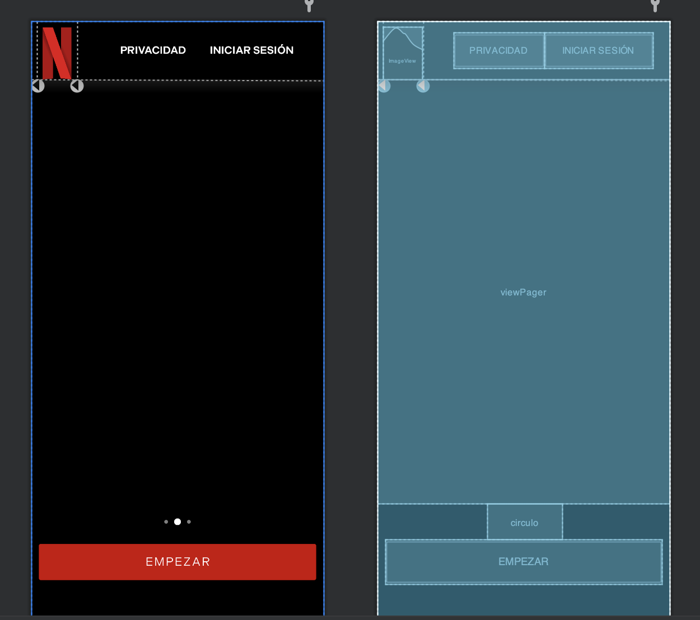
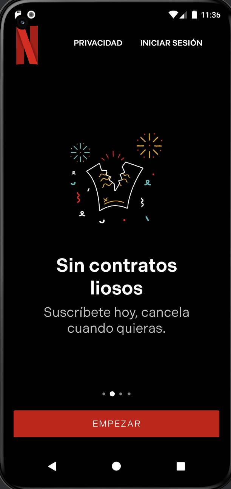
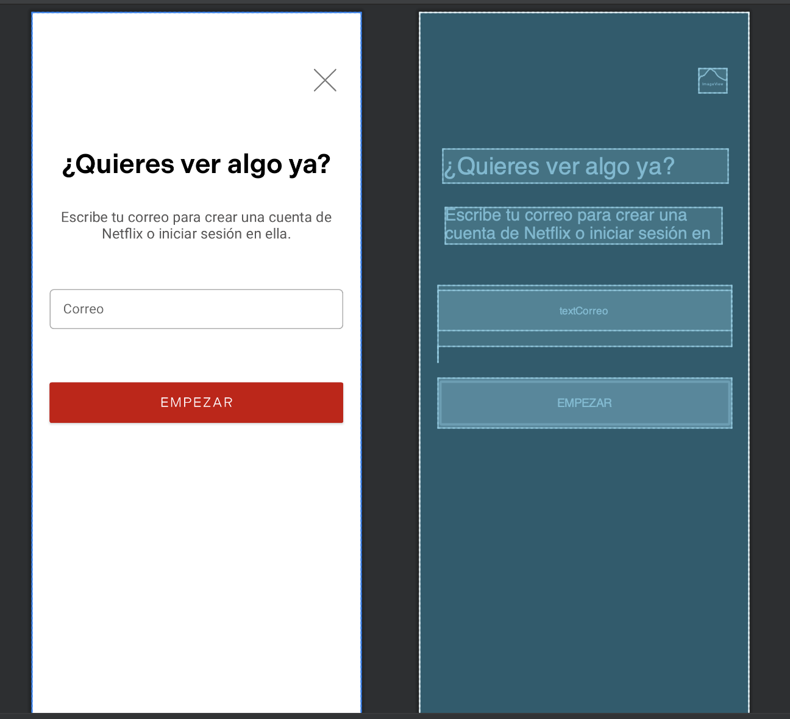
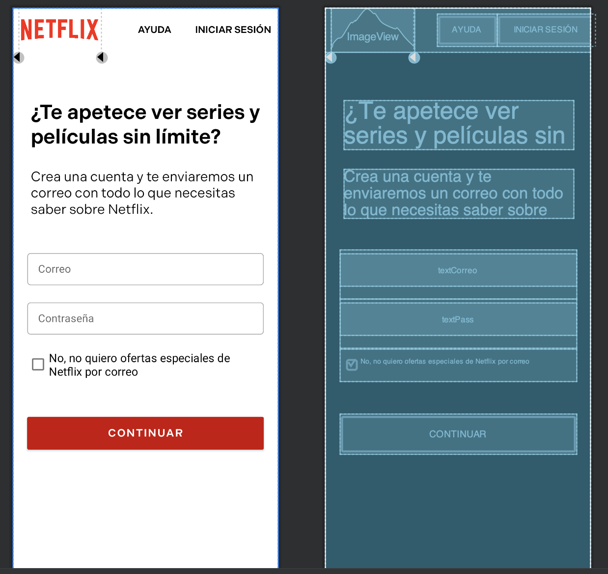
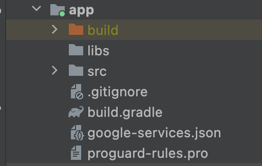
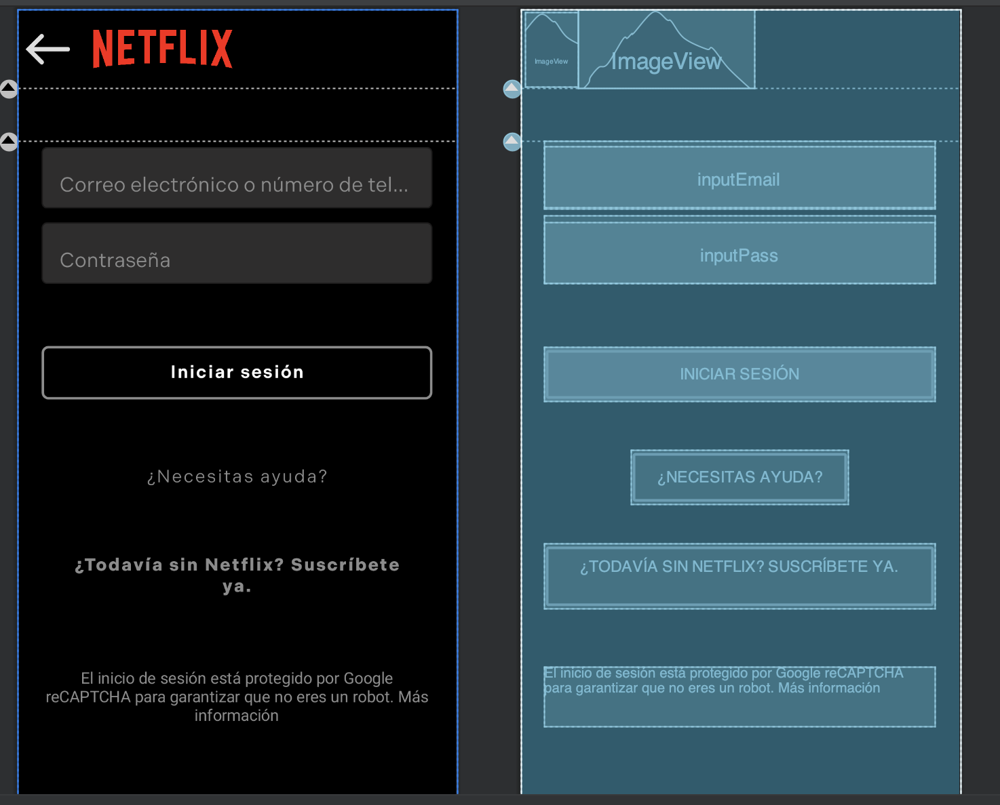
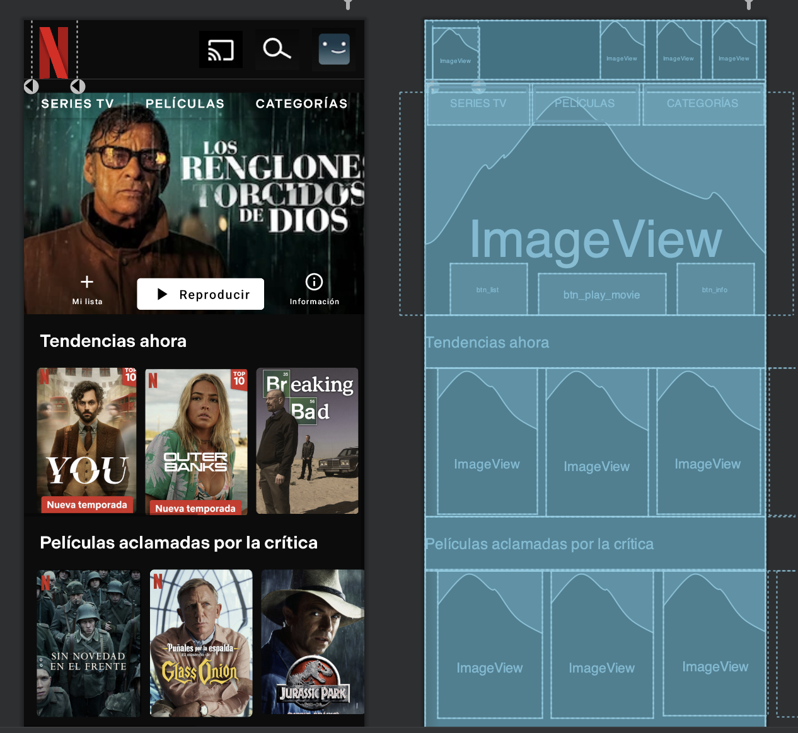

# Trabajo Final - Recreación de Netflix

### Llevado a cabo por:

Javier Alcantarilla Ballesteros

## Introducción

En este trabajo he optado por reaalizar la recreación de la platafrma de streaming Netflix.


## Índice

1. Layout Empezar.
4. Funciones y clases de Layout Empezar.
5. Layout Registro.
6. Funciones y funcionalidades de la Activity Registro.
7. Layout Registro2.
9. Implementación de Firebase.
8. Funciones y funcionalidades de la Activity Registro2.
9. Layout Login.
10. Funciones y funcionalidades de la Activity Login.
11. Layout Principal.


## Layout Empezar

Este layout es básicamente el comienzo de la aplicación. Hay una cabecera con el logo de Netflix y dos botones, uno de privacidad y otro de Iniciar sesión. Debajo tiene una de las cosas que, sin duda, más me ha costado hacer: un slider de layouts con su propio indicador con círculos que nos dé la información de la "página" en la que nos encontramos.

El resultado final de la vista del diseño del layout es el siguiente:



Vamos con el código:

La parte de la cabecera es la siguiente:

```xml
<androidx.constraintlayout.widget.ConstraintLayout xmlns:android="http://schemas.android.com/apk/res/android"
    xmlns:app="http://schemas.android.com/apk/res-auto"
    xmlns:tools="http://schemas.android.com/tools"
    android:layout_width="match_parent"
    android:layout_height="match_parent"
    android:background="@color/black"
    tools:context=".ActivityEmpezar">

    <androidx.constraintlayout.widget.ConstraintLayout
        android:id="@+id/cabecera_nav"
        android:layout_width="match_parent"
        android:layout_height="wrap_content"
        app:layout_constraintEnd_toEndOf="parent"
        app:layout_constraintStart_toStartOf="parent"
        app:layout_constraintTop_toTopOf="parent">

        <Button
            android:id="@+id/iniciar_sesion2"
            style="@style/Widget.AppCompat.Button"
            android:layout_width="wrap_content"
            android:layout_height="48dp"
            android:background="@android:color/transparent"
            android:fontFamily="@font/indivisible_semibold"
            android:text="@string/iniciar_ses"
            android:textSize="14sp"
            app:layout_constraintBottom_toBottomOf="parent"
            app:layout_constraintStart_toEndOf="@+id/ayuda"
            app:layout_constraintTop_toTopOf="parent" />

        <Button
            android:id="@+id/ayuda"
            style="@style/Widget.AppCompat.Button"
            android:layout_width="wrap_content"
            android:layout_height="wrap_content"
            android:background="@android:color/transparent"
            android:fontFamily="@font/indivisible_semibold"
            android:text="privacidad"
            app:layout_constraintBottom_toBottomOf="parent"
            app:layout_constraintEnd_toEndOf="parent"
            app:layout_constraintHorizontal_bias="0.2"
            app:layout_constraintStart_toEndOf="@+id/imageView2"
            app:layout_constraintTop_toTopOf="parent" />

        <ImageView
            android:id="@+id/imageView2"
            android:layout_width="0dp"
            android:layout_height="70dp"
            android:layout_marginTop="8dp"
            android:src="@drawable/netflix_2015_n_logo_svg"
            app:layout_constraintBottom_toBottomOf="parent"
            app:layout_constraintEnd_toStartOf="@+id/guideline"
            app:layout_constraintStart_toStartOf="@+id/guideline2"
            app:layout_constraintTop_toTopOf="parent" />

        <androidx.constraintlayout.widget.Guideline
            android:id="@+id/guideline"
            android:layout_width="wrap_content"
            android:layout_height="wrap_content"
            android:orientation="vertical"
            app:layout_constraintGuide_begin="61dp" />

        <androidx.constraintlayout.widget.Guideline
            android:id="@+id/guideline2"
            android:layout_width="wrap_content"
            android:layout_height="wrap_content"
            android:orientation="vertical"
            app:layout_constraintGuide_begin="8dp" />
    </androidx.constraintlayout.widget.ConstraintLayout>
```

El layout principal es un ```Constraint Layout```, el cuál he puesto de color de fondo negro. Para definir la cabecera he utilizado otro Constraint Layout dentro, en el que van a ir todos los elementos de la misma. Empezamos con el logo de Netflix, que es una imageView normal y corriente, con unas constraints definidas al principio y al final de la misma en relación a dos guidelines que he usado para definir un tamaño fijo y responsive a la imagen.

Después, los botones de "Privacidad" e "Iniciar sesión" son botones con el fondo transparente y el tamaño de la letra alterado. 

Para el tipo de fuente usado en la aplicación, he usado la del propio Netflix, llamada ```"Indivisible Semi-Bold"```, la cuál he importado en un paquete de recursos que he creado en la carpeta ```res```.

Pasemos ahora al fuerte del layout, el ```ViewPager2```. Para poder implementar este control, junto con el ```CircleIndicator```, he tenido que agregar sus dependencias al archivo de gradle a nivel de aplicación:

```gradle
    implementation 'androidx.viewpager2:viewpager2:1.0.0'
    implementation 'me.relex:circleindicator:2.1.6'
```

El control ViewPager2, es simplemente un contenedor donde puedes meter una plantilla de un Layout y, poner tantos "layouts" de esa misma plantilla como quieras, para que al deslizar, vayas cambiando de una a otra.

El control CircleIndicator, es básicamente el indicador con círculos que tendrá tantos círculos como "vistas" tenga el ViewPager y que irá cambiando según la vista que esté activa en ese momento en el ViewPager.

Estos controles se definen en su mayoría por código, así que en el propio ```xml``` no hay mucho que hacer excepto definir su tamaño y sus constraints:
```xml
<androidx.viewpager2.widget.ViewPager2
        android:id="@+id/viewPager"
        android:layout_width="0dp"
        android:layout_height="570dp"
        app:layout_constraintBottom_toBottomOf="parent"
        app:layout_constraintEnd_toEndOf="parent"
        app:layout_constraintStart_toStartOf="parent"
        app:layout_constraintTop_toBottomOf="@+id/cabecera_nav"
        app:layout_constraintVertical_bias="0" />

    <me.relex.circleindicator.CircleIndicator3
        android:id="@+id/circulo"
        android:layout_width="100dp"
        android:layout_height="48dp"
        app:layout_constraintEnd_toEndOf="parent"
        app:layout_constraintStart_toStartOf="parent"
        app:layout_constraintTop_toBottomOf="@+id/viewPager" />
```

Mi plantilla creada para el ViewPager, que luego modificaremos a través del código, es la siguiente:

```xml
<androidx.constraintlayout.widget.ConstraintLayout xmlns:android="http://schemas.android.com/apk/res/android"
    xmlns:app="http://schemas.android.com/apk/res-auto"
    xmlns:tools="http://schemas.android.com/tools"
    android:layout_width="match_parent"
    android:layout_height="match_parent"
    android:background="@color/black">

    <TextView
        android:id="@+id/tituloView"
        android:layout_width="320dp"
        android:layout_height="wrap_content"
        android:fontFamily="@font/indivisible_semibold"
        android:text="Todas las películas y series que desees, y mucho más."
        android:textAlignment="center"
        android:textColor="@color/white"
        android:textSize="34sp"
        app:layout_constraintBottom_toBottomOf="parent"
        app:layout_constraintEnd_toEndOf="parent"
        app:layout_constraintStart_toStartOf="parent"
        app:layout_constraintTop_toTopOf="parent"
        app:layout_constraintVertical_bias="0.7" />

    <TextView
        android:id="@+id/descripcionView"
        android:layout_width="320dp"
        android:layout_height="wrap_content"
        android:fontFamily="@font/ind_reg"
        android:text="Disfruta donde quieras. Cancela cuando quieras."
        android:textAlignment="center"
        android:textColor="#C6C6C6"
        android:textSize="24sp"
        app:layout_constraintBottom_toBottomOf="parent"
        app:layout_constraintEnd_toEndOf="parent"
        app:layout_constraintStart_toStartOf="parent"
        app:layout_constraintTop_toBottomOf="@+id/tituloView"
        app:layout_constraintVertical_bias="0.1" />

    <ImageView
        android:id="@+id/imagenView"
        android:layout_width="315dp"
        android:layout_height="197dp"
        app:layout_constraintBottom_toTopOf="@+id/tituloView"
        app:layout_constraintEnd_toEndOf="parent"
        app:layout_constraintStart_toStartOf="parent"
        app:layout_constraintTop_toTopOf="parent"
        app:layout_constraintVertical_bias="0.7"
        app:srcCompat="@drawable/netflix_2015_n_logo_svg" />
</androidx.constraintlayout.widget.ConstraintLayout>
```
Es un Layout muy básico, un ConstraintLayout con un fondo negro, una imagen en la que por defecto he puesto el logo de Netflix (esto se cambiará luego en el código) y dos TextViews con un formato personalizado.

Esta será la plantilla a utilizar, todas las vistas del ViewPager tendrán los mismos controles, lo único que haremos a través del código será cambiar la información y la imagen.

Para terminar este layout, tenemos un botón de fondo rojo con texto "Empezar" que nos llevará al siguiente Layout, el registro:
```xml
<Button
        android:id="@+id/botonEmpezarRegistro"
        android:layout_width="0dp"
        android:layout_height="60dp"
        android:layout_marginStart="10dp"
        android:layout_marginEnd="10dp"
        android:backgroundTint="@android:color/holo_red_dark"
        android:fontFamily="@font/ind_reg"
        android:text="empezar"
        android:textSize="16sp"
        app:cornerRadius="2dp"
        app:layout_constraintEnd_toEndOf="parent"
        app:layout_constraintStart_toStartOf="parent"
        app:layout_constraintTop_toBottomOf="@+id/circulo" />
```

## Funciones y clases de la Activity Empezar

Antes de pasar al código de la propia Activity, hay que pasar a la clase ```ViewAdapter``` que será una clase que forme un adaptador para el ViewPager, con todas las vistas que queremos mostrar a partir de la plantilla creada anteriormente.

```kotlin
class ViewAdapter(private var titulo:List<String>, private var descripcion:List<String>, private var imagenesList: List<Int>):
RecyclerView.Adapter<ViewAdapter.Pager2ViewHolder>(){

    inner class Pager2ViewHolder(item: View): RecyclerView.ViewHolder(item){
        val itemTitulo = item.findViewById<TextView>(R.id.tituloView)
        val itemDesc= item.findViewById<TextView>(R.id.descripcionView)
        val itemImagen= item.findViewById<ImageView>(R.id.imagenView)
    }

    override fun onCreateViewHolder(parent: ViewGroup, viewType: Int): ViewAdapter.Pager2ViewHolder {
        return Pager2ViewHolder(LayoutInflater.from(parent.context).inflate(R.layout.vistas_layout, parent, false))
    }

    @SuppressLint("ResourceAsColor")
    override fun onBindViewHolder(holder: ViewAdapter.Pager2ViewHolder, position: Int) {
        holder.itemTitulo.text=titulo[position]
        holder.itemDesc.text=descripcion[position]

        holder.itemImagen.setImageResource(imagenesList[position])
        holder.itemView.setBackgroundResource(R.color.black)
    }

    override fun getItemCount(): Int {
        return titulo.size
    }

}
```

Creamos la clase con parámetros de entrada que serán las listas de los elementos que queremos que se creen en las distintas vistas. Es decir, le pasamos en este caso tres listas: una lista de strings que serán las strings que quiero que se pongan en uno de los ```TextView```de la plantilla, otra lista de strings que hará lo mismo pero con el otro TextView y una lista de ```Integer`` que serán los recursos de las imágenes que quiero que se pongan.

De este modo, la primera vista del ViewPager estará formada por las primeras posiciones en cada uno de los arrays, y formará tantas vistas como elementos tengan los arrays.

El método más importante de la clase es ```onBindViewHolder```, que es el encargado de recorrer el ```Adapter``` (llamado holder en este caso)  y poner en cada uno de los controles los valores que contienen los distintos arrays que hemos pasado por parámetro.

Pasemos ahora a la propia Activity:

Lo primero es definir las tres listas que pasaremos como parámetro a la clase ```ViewAdapter``` que más tarde inicializaremos con los valores que queremos.

En el onCreate llamaremos al método ```postToList()``` el cúal explicaré a continuación, después igualamos el ```adapter``` del viewPager a un nuevo objeto de la clase ```ViewPager``` pasando como parámetro las listas que hemos inicializado en el método ```postToList```.

Por último nos crearemos una constante para el ```CircleIndicator``` y a través de su método propio ```setViewPager``` le asignaremos el ViewPager del layout.

```kotlin
class ActivityEmpezar : AppCompatActivity() {
    private var listaTitulo= mutableListOf<String>()
    private var descripcionLista= mutableListOf<String>()
    private var imagenesLista= mutableListOf<Int>()

    lateinit var binding:ActivityEmpezarBinding
    override fun onCreate(savedInstanceState: Bundle?) {
        super.onCreate(savedInstanceState)
        binding= ActivityEmpezarBinding.inflate(layoutInflater)
        setContentView(binding.root)
        val viewPager= findViewById<ViewPager2>(R.id.viewPager)
        val indicator= findViewById<CircleIndicator3>(R.id.circulo)
        postToList()
        viewPager.adapter= ViewAdapter(listaTitulo, descripcionLista, imagenesLista)

        indicator.setViewPager(viewPager)
        boton()
    }
```
Función ```postToList``` y ```addToList``` (básicamente inicializa las listas con los valores que queremos):

```kotlin
private fun addToList(title: String, descripcion:String, imagen: Int)   {
        listaTitulo.add(title)
        descripcionLista.add(descripcion)
        imagenesLista.add(imagen)
        }

private fun postToList(){
        addToList("Todas las películas y series que desees, y mucho más.", "Disfruta donde quieras. Cancela cuando quieras",
        R.drawable.backgroundempezar)
        addToList("Sin contratos liosos", "Suscríbete hoy, cancela cuando quieras.",
            R.drawable.imagen2)
        addToList("Tú decides cómo lo ves", "En tu teléfono, tablet, computadora y TV sin costo extra.",
            R.drawable.imagen1)
        addToList("3, 2, 1 ... ¡Descarga!", "Las descargas solo están disponibles en tus planes sin anuncios.",
            R.drawable.imagen3)
    }
```
Función ```boton``` (cambia de activity al pulsar el botón ```Empezar```):

```kotlin
private fun boton(){
        binding.botonEmpezarRegistro.setOnClickListener {
            val intent= Intent(this, Registro::class.java)
            startActivity(intent)
        }
        binding.iniciarSesion2.setOnClickListener {
            val intent = Intent(this, Login::class.java)
            startActivity(intent)
        }
    }
```

El resultado final del layout es el siguiente:



## Layout Registro.

Al pulsar el botón Empezar en el siguiente layout, nos manda a este layout. El registro en esta aplicación consta de dos partes, en la primera introduces el email y en la segunda, revisas el email e introudces la contraseña.

Este layout es la primera parte, es un layout muy básico:



Es un ```ConstraintLayout``` que contiene dos ```TextView```, un ```TextInputLayout``` para introducir el correo, el cuál se controlará en el código de la actividad y un botón para continuar a la siguiente Activity.

También contiene una ```ImageView``` de una cruz gris, si pinchas en ella te llevará a la Activity anterior.

El código es el siguiente:

```xml
<?xml version="1.0" encoding="utf-8"?>
<androidx.constraintlayout.widget.ConstraintLayout xmlns:android="http://schemas.android.com/apk/res/android"
    xmlns:app="http://schemas.android.com/apk/res-auto"
    xmlns:tools="http://schemas.android.com/tools"
    android:layout_width="match_parent"
    android:layout_height="match_parent"
    tools:context=".Registro">

    <Button
        android:id="@+id/botonEmpezarRegistro3"
        android:layout_width="350dp"
        android:layout_height="60dp"
        android:backgroundTint="@android:color/holo_red_dark"
        android:fontFamily="@font/ind_reg"
        android:text="empezar"
        android:textSize="16sp"
        app:cornerRadius="2dp"
        app:layout_constraintBottom_toBottomOf="parent"
        app:layout_constraintEnd_toEndOf="parent"
        app:layout_constraintStart_toStartOf="parent"
        app:layout_constraintTop_toBottomOf="@+id/textoError"
        app:layout_constraintVertical_bias="0.05" />

    <TextView
        android:id="@+id/textView2"
        android:layout_width="330dp"
        android:layout_height="wrap_content"
        android:gravity="center"
        android:text="Escribe tu correo para crear una cuenta de Netflix o iniciar sesión en ella."
        android:textColor="#575656"
        android:textSize="17sp"
        app:layout_constraintBottom_toBottomOf="parent"
        app:layout_constraintEnd_toEndOf="parent"
        app:layout_constraintStart_toStartOf="parent"
        app:layout_constraintTop_toBottomOf="@+id/tituloFragment"
        app:layout_constraintVertical_bias="0.05" />

    <TextView
        android:id="@+id/tituloFragment"
        android:layout_width="340dp"
        android:layout_height="wrap_content"
        android:fontFamily="@font/indivisible_semibold"
        android:gravity="center"
        android:text="¿Quieres ver algo ya?"
        android:textColor="@color/black"
        android:textSize="32sp"
        app:layout_constraintBottom_toBottomOf="parent"
        app:layout_constraintEnd_toEndOf="parent"
        app:layout_constraintStart_toStartOf="parent"
        app:layout_constraintTop_toTopOf="parent"
        app:layout_constraintVertical_bias="0.20" />

    <TextView
        android:id="@+id/textoError"
        android:layout_width="wrap_content"
        android:layout_height="wrap_content"
        app:layout_constraintStart_toStartOf="@+id/textInputLayout"
        app:layout_constraintTop_toBottomOf="@+id/textInputLayout" />

    <com.google.android.material.textfield.TextInputLayout
        android:id="@+id/textInputLayout"
        style="@style/LoginTextInputLayoutStyle"
        android:layout_width="350dp"
        android:layout_height="wrap_content"
        app:boxBackgroundColor="@color/white"
        app:boxBackgroundMode="outline"
        app:boxCornerRadiusBottomEnd="5dp"
        app:boxCornerRadiusBottomStart="5dp"
        app:boxCornerRadiusTopEnd="5dp"
        app:boxCornerRadiusTopStart="5dp"
        app:boxStrokeErrorColor="#E40202"
        app:boxStrokeWidth="1dp"
        app:errorEnabled="true"
        app:hintTextColor="#8F8F8F"
        app:layout_constraintBottom_toBottomOf="parent"
        app:layout_constraintEnd_toEndOf="parent"
        app:layout_constraintStart_toStartOf="parent"
        app:layout_constraintTop_toBottomOf="@+id/textView2"
        app:layout_constraintVertical_bias="0.1">

        <com.google.android.material.textfield.TextInputEditText
            android:id="@+id/textCorreo"
            android:layout_width="match_parent"
            android:layout_height="wrap_content"
            android:hint="Correo"
            android:inputType="textWebEmailAddress"
            android:singleLine="false"
            android:textColorHint="#AEACAC" />
    </com.google.android.material.textfield.TextInputLayout>

    <ImageView
        android:id="@+id/imagenCruz"
        android:layout_width="33dp"
        android:layout_height="29dp"
        app:layout_constraintBottom_toTopOf="@+id/tituloFragment"
        app:layout_constraintEnd_toEndOf="@+id/tituloFragment"
        app:layout_constraintTop_toTopOf="parent"
        app:srcCompat="@drawable/icone_x_grise" />

</androidx.constraintlayout.widget.ConstraintLayout>
```

Elementos a destacar:

- Para el correo he decidido usar un ```TextInputLayout``` para poder darle un formato más personalizado a la introducción del correo. He usado un estilo propio que he usado para cambiar de color los bordes del ```TextInput``` en caso de estar focused o no:

```xml
    <style name="LoginTextInputLayoutStyle" parent="Widget. MaterialComponents.TextInputLayout.OutlinedBox.Dense">
        <item name="boxStrokeColor">@color/color_edittext</item>
    </style>
```

- Para ello he creado un paquete de recursos nuevo llamado color, de tipo de recursos ```selector```:
```xml
<?xml version="1.0" encoding="utf-8"?>
<selector xmlns:android="http://schemas.android.com/apk/res/android">
    <item android:color="#049ccf" android:state_focused="true"/>
    <item android:color="#ababab"/>
</selector>
```

- Por último, en el ```TextInput``` he definido que sea un ```InputType``` de ```textWebEmailAddress``` para el correo.

## Funciones y funcionalidades de la Activity Registro.

```kotlin
class Registro : AppCompatActivity() {
    lateinit var binding: ActivityRegistroBinding
    override fun onCreate(savedInstanceState: Bundle?) {
        super.onCreate(savedInstanceState)
        binding= ActivityRegistroBinding.inflate(layoutInflater)
        setContentView(binding.root)

        botones()
    }

    fun botones(){
        binding.botonEmpezarRegistro3.setOnClickListener {
            if (binding.textCorreo.text!!.isEmpty()){
                binding.textoError.text= "El correo es obligatorio."
                binding.textoError.setTextColor(getColor(R.color.red))
                binding.textInputLayout.boxStrokeColor= getColor(R.color.red)
            }else{
                binding.textInputLayout.boxStrokeColor= getColor(R.color.green)
                val intent= Intent(this, Registro2::class.java)
                intent.putExtra("CORREO", binding.textCorreo.text.toString())
                startActivity(intent)
            }
        }
        binding.imagenCruz.setOnClickListener {
            val intent= Intent(this, ActivityEmpezar::class.java)
            startActivity(intent)
        }
    }
}
```

Es un código muy simple. Tenemos la función ```botones``` que lo que hace es añadir un Listener al botón ```Empezar``` y que cuando se pulse compruebe que el ```TextInput``` no está vacío. Si está vacío el borde aparecerá en rojo y aparecerá un texto comunicando el error. Si no está vacío y es correcto se pondrá el correo en un intent y se pasará a la siguiente Activity del registro.

Por otro lado si se pulsa sobre la imagen de la cruz se volverá a la primera Activity.

## Layout Registro2.



La segunda parte de este Layout contiene una cabecera como en el primer layout, simplemente el logotipo es distinto y en vez de un botón de "Privacidad" hay un botón de "Ayuda".

Contiene dos ```TextView``` como en el anterior y dos ```TextInputLayout```, uno con el correo que le hemos pasado de la actividad anterior (lo veremos en el código) y otro con la contraseña que queremos crear, ambos con el mismo estilo del anterior layout.

En el ```TextInput``` de la contraseña he puesto un ```InputType``` de password, para que el dato introducido sea de tipo contraseña.

La novedad en este Layout es el ```CheckBox``` de la ofertas especiales.

Por último tendremos un botón "Continuar" que nos llevará al inicio de sesión.

El código es el siguiente:

```xml
<?xml version="1.0" encoding="utf-8"?>
<androidx.constraintlayout.widget.ConstraintLayout xmlns:android="http://schemas.android.com/apk/res/android"
    xmlns:app="http://schemas.android.com/apk/res-auto"
    xmlns:tools="http://schemas.android.com/tools"
    android:layout_width="match_parent"
    android:layout_height="match_parent"
    tools:context=".Registro2">

    <Button
        android:id="@+id/botonContinuar"
        android:layout_width="350dp"
        android:layout_height="60dp"
        android:backgroundTint="@android:color/holo_red_dark"
        android:fontFamily="@font/indivisible_semibold"
        android:text="continuar"
        android:textSize="16sp"
        app:cornerRadius="2dp"
        app:layout_constraintBottom_toBottomOf="parent"
        app:layout_constraintEnd_toEndOf="parent"
        app:layout_constraintStart_toStartOf="parent"
        app:layout_constraintTop_toBottomOf="@+id/checkBox"
        app:layout_constraintVertical_bias="0.2" />

    <com.google.android.material.textfield.TextInputLayout
        android:id="@+id/textInputLayout3"
        style="@style/LoginTextInputLayoutStyle"
        android:layout_width="350dp"
        android:layout_height="wrap_content"
        app:boxBackgroundColor="@color/white"
        app:boxBackgroundMode="outline"
        app:boxCornerRadiusBottomEnd="5dp"
        app:boxCornerRadiusBottomStart="5dp"
        app:boxCornerRadiusTopEnd="5dp"
        app:boxCornerRadiusTopStart="5dp"
        app:boxStrokeErrorColor="#E40202"
        app:boxStrokeWidth="1dp"
        app:errorEnabled="true"
        app:hintTextColor="#8F8F8F"
        app:layout_constraintBottom_toBottomOf="parent"
        app:layout_constraintEnd_toEndOf="parent"
        app:layout_constraintStart_toStartOf="parent"
        app:layout_constraintTop_toBottomOf="@+id/textInputLayout"
        app:layout_constraintVertical_bias="0">

        <com.google.android.material.textfield.TextInputEditText
            android:id="@+id/textPass"
            android:layout_width="match_parent"
            android:layout_height="wrap_content"
            android:hint="Contraseña"
            android:inputType="textPassword"
            android:singleLine="false"
            android:textColorHint="#AEACAC" />
    </com.google.android.material.textfield.TextInputLayout>

    <com.google.android.material.textfield.TextInputLayout
        android:id="@+id/textInputLayout"
        style="@style/LoginTextInputLayoutStyle"
        android:layout_width="350dp"
        android:layout_height="wrap_content"
        app:boxBackgroundColor="@color/white"
        app:boxBackgroundMode="outline"
        app:boxCornerRadiusBottomEnd="5dp"
        app:boxCornerRadiusBottomStart="5dp"
        app:boxCornerRadiusTopEnd="5dp"
        app:boxCornerRadiusTopStart="5dp"
        app:boxStrokeErrorColor="#E40202"
        app:boxStrokeWidth="1dp"
        app:errorEnabled="true"
        app:hintTextColor="#8F8F8F"
        app:layout_constraintBottom_toBottomOf="parent"
        app:layout_constraintEnd_toEndOf="parent"
        app:layout_constraintStart_toStartOf="parent"
        app:layout_constraintTop_toBottomOf="@+id/textoRegistro2"
        app:layout_constraintVertical_bias="0.1">

        <com.google.android.material.textfield.TextInputEditText
            android:id="@+id/textCorreo"
            android:layout_width="match_parent"
            android:layout_height="wrap_content"
            android:hint="Correo"
            android:inputType="textWebEmailAddress"
            android:singleLine="false"
            android:textColorHint="#AEACAC" />
    </com.google.android.material.textfield.TextInputLayout>

    <androidx.constraintlayout.widget.ConstraintLayout
        android:id="@+id/cabecera_nav"
        android:layout_width="match_parent"
        android:layout_height="wrap_content"
        app:layout_constraintEnd_toEndOf="parent"
        app:layout_constraintStart_toStartOf="parent"
        app:layout_constraintTop_toTopOf="parent">

        <Button
            android:id="@+id/iniciar_sesion2"
            style="@style/Widget.AppCompat.Button"
            android:layout_width="wrap_content"
            android:layout_height="48dp"
            android:background="@android:color/transparent"
            android:fontFamily="@font/indivisible_semibold"
            android:text="@string/iniciar_ses"
            android:textColor="@color/black"
            android:textSize="14sp"
            app:layout_constraintBottom_toBottomOf="parent"
            app:layout_constraintStart_toEndOf="@+id/ayuda"
            app:layout_constraintTop_toTopOf="parent" />

        <Button
            android:id="@+id/ayuda"
            style="@style/Widget.AppCompat.Button"
            android:layout_width="wrap_content"
            android:layout_height="wrap_content"
            android:background="@android:color/transparent"
            android:fontFamily="@font/indivisible_semibold"
            android:text="ayuda"
            android:textColor="@color/black"
            app:layout_constraintBottom_toBottomOf="parent"
            app:layout_constraintEnd_toEndOf="parent"
            app:layout_constraintHorizontal_bias="0.2"
            app:layout_constraintStart_toEndOf="@+id/imageView"
            app:layout_constraintTop_toTopOf="parent" />

        <androidx.constraintlayout.widget.Guideline
            android:id="@+id/guideline"
            android:layout_width="wrap_content"
            android:layout_height="wrap_content"
            android:orientation="vertical"
            app:layout_constraintGuide_begin="131dp" />

        <androidx.constraintlayout.widget.Guideline
            android:id="@+id/guideline2"
            android:layout_width="wrap_content"
            android:layout_height="wrap_content"
            android:orientation="vertical"
            app:layout_constraintGuide_begin="8dp" />

        <ImageView
            android:id="@+id/imageView"
            android:layout_width="0dp"
            android:layout_height="65dp"
            app:layout_constraintBottom_toBottomOf="parent"
            app:layout_constraintEnd_toStartOf="@+id/guideline"
            app:layout_constraintStart_toStartOf="@+id/guideline2"
            app:layout_constraintTop_toTopOf="parent"
            app:srcCompat="@drawable/logo_grande" />
    </androidx.constraintlayout.widget.ConstraintLayout>

    <TextView
        android:id="@+id/tituloRegistro2"
        android:layout_width="340dp"
        android:layout_height="wrap_content"
        android:fontFamily="@font/indivisible_semibold"
        android:text="¿Te apetece ver series y películas sin límite?"
        android:textColor="@color/black"
        android:textSize="30sp"
        app:layout_constraintBottom_toBottomOf="parent"
        app:layout_constraintEnd_toEndOf="parent"
        app:layout_constraintStart_toStartOf="parent"
        app:layout_constraintTop_toBottomOf="@+id/cabecera_nav"
        app:layout_constraintVertical_bias="0.1" />

    <TextView
        android:id="@+id/textoRegistro2"
        android:layout_width="340dp"
        android:layout_height="wrap_content"
        android:fontFamily="@font/ind_reg"
        android:text="Crea una cuenta y te enviaremos un correo con todo lo que necesitas saber sobre Netflix."
        android:textColor="@color/black"
        android:textSize="20sp"
        app:layout_constraintBottom_toBottomOf="parent"
        app:layout_constraintStart_toStartOf="@+id/tituloRegistro2"
        app:layout_constraintTop_toBottomOf="@+id/tituloRegistro2"
        app:layout_constraintVertical_bias="0.05" />

    <CheckBox
        android:id="@+id/checkBox"
        android:layout_width="350dp"
        android:layout_height="wrap_content"
        android:text="No, no quiero ofertas especiales de Netflix por correo"
        android:textSize="17sp"
        app:layout_constraintBottom_toBottomOf="parent"
        app:layout_constraintStart_toStartOf="@+id/textInputLayout3"
        app:layout_constraintTop_toBottomOf="@+id/textInputLayout3"
        app:layout_constraintVertical_bias="0" />
</androidx.constraintlayout.widget.ConstraintLayout>
```

## Implementación de Firebase

Antes de pasar al código del Layout, voy a explicar la implementación con Firebase, que he usado para crear el login y registro.

Para implementar Firebase tienes que dirigirte a su página web, crear un proyecto y agregar tu aplicación al mismo. Una vez hecho esto la propia página te va guiando en lo que debes hacer para implementarlo en tu proyecto. Primero tendrás que descargarte un archivo ```json``` que te proporcionan y ponerlo a nivel de aplicación en tu proyecto:



El archivo es google-services.json.

Posteriormente debes agregar al build.gradle a nivel de proyecto lo siguiente:

```gradle
buildscript {
  repositories {
    // Make sure that you have the following two repositories
    google()  // Google's Maven repository
content_copy

    mavenCentral()  // Maven Central repository
content_copy

  }
  dependencies {
    ...
    // Add the dependency for the Google services Gradle plugin
    classpath 'com.google.gms:google-services:4.3.15'
content_copy

  }
}
```

A nivel de aplicación también debes agregar:

```gradle
plugins {
  id 'com.android.application'
content_copy

  // Add the Google services Gradle plugin
  id 'com.google.gms.google-services'
content_copy

  ...
}

dependencies {
  // Import the Firebase BoM
  implementation platform('com.google.firebase:firebase-bom:31.2.2')
content_copy


  // TODO: Add the dependencies for Firebase products you want to use
  // When using the BoM, don't specify versions in Firebase dependencies
  // https://firebase.google.com/docs/android/setup#available-libraries
}
```

Como en este caso usaremos el módulo de authentication de firebase, debemos implementar la siguiente dependencia también a nivel de app:

```gradle
implementation 'com.google.firebase:firebase-auth'
```

Con esto ya estaría implementado Firebase en el proyecto.

## Funciones y funcionalidades de la Activity Registro2.

```kotlin
class Registro2 : AppCompatActivity() {
    lateinit var binding: ActivityRegistro2Binding
    override fun onCreate(savedInstanceState: Bundle?) {
        super.onCreate(savedInstanceState)
        binding= ActivityRegistro2Binding.inflate(layoutInflater)
        setContentView(binding.root)
        binding.textCorreo.setText(intent.getStringExtra("CORREO"))
        registro()
        goIniciar()
    }

    private fun registro(){
        binding.botonContinuar.setOnClickListener{
            if (binding.textCorreo.text!!.isNotEmpty() && binding.textPass.text!!.isNotEmpty()){
                FirebaseAuth.getInstance().createUserWithEmailAndPassword(binding.textCorreo.text.toString(),
                    binding.textPass.text.toString()).addOnCompleteListener{
                    if (it.isSuccessful){
                        val intent= Intent(this, Login::class.java)
                        startActivity(intent)
                    }else{
                        binding.textInputLayout3.boxStrokeColor= getColor(R.color.red)
                    }
                }
            }
        }
    }

    private fun goIniciar(){
        binding.iniciarSesion2.setOnClickListener {
            val intent= Intent(this, Login::class.java)
            startActivity(intent)
        }
    }
}
```

Lo primero que hacemos al entrar en la Activity es recoger el correo que hemos pasado por el intent en la actividad de registro y lo ponemos de texto en el ```TextInputCorreo```.

Creamos una función con un listener en el botón de Continuar, comprobamos con una condición que no estén vacíos ninguno de los dos ```TextInput```, si no están vacíos llamamos al método de Firebase Authentication llamado ```createUserWithEmailAndPassword``` y le pasamos como parámetros el correo y la contraseña. Añadimos un onCompleteListener que lo que hará es que si se ha completado correctamente, pase a la siguiente actividad. En caso contrario, pondrá los border de los ```TextInput``` en rojo.

Después ponemos una función ```goIniciar``` para el botón Iniciar Sesión que nos llevará a la Activity Login.

## Layout Login.



En este layout tenemos también una cabecera con el logo de netflix, como en los anteriores layouts, solo que esta vez no tenemos botones a la derecha, sino que a la izquierda tenemos un ```ImageView``` con una flecha para volver a la anterior Activity.

Después tenemos otros dos ```TextInputLayout``` con el correo y la contraseña del login, un botón para iniciar sesión con un estilo definido para que sólo se vean los bordes, un ```TextView```, otro botón con fondo transparente que te llevará a la Activity de registro y, por último, otro ```TextView```

```xml
<?xml version="1.0" encoding="utf-8"?>
<androidx.constraintlayout.widget.ConstraintLayout xmlns:android="http://schemas.android.com/apk/res/android"
    xmlns:app="http://schemas.android.com/apk/res-auto"
    xmlns:tools="http://schemas.android.com/tools"
    android:layout_width="match_parent"
    android:layout_height="match_parent"
    android:background="@color/black"
    tools:context=".Login">

    <com.google.android.material.textfield.TextInputLayout
        android:id="@+id/textInputLayout5"
        android:layout_width="350dp"
        android:layout_height="wrap_content"
        android:layout_marginTop="7dp"
        android:textAlignment="textEnd"
        android:textColorHint="@color/gris"
        app:boxBackgroundColor="@color/gris_negro"
        app:boxBackgroundMode="outline"
        app:boxCornerRadiusBottomEnd="5dp"
        app:boxCornerRadiusBottomStart="5dp"
        app:boxCornerRadiusTopEnd="5dp"
        app:boxCornerRadiusTopStart="5dp"
        app:boxStrokeColor="@color/gris_negro"
        app:hintAnimationEnabled="true"
        app:hintTextColor="@color/gris"
        app:layout_constraintEnd_toEndOf="parent"
        app:layout_constraintStart_toStartOf="parent"
        app:layout_constraintTop_toBottomOf="@+id/textInputLayout4">

        <com.google.android.material.textfield.TextInputEditText
            android:id="@+id/inputPass"
            android:layout_width="match_parent"
            android:layout_height="wrap_content"
            android:fontFamily="@font/ind_reg"
            android:hint="Contraseña"
            android:inputType="textPassword"
            android:textAlignment="viewStart"
            android:textColor="@color/gris"
            android:textColorHint="@color/gris"
            android:textSize="18sp" />
    </com.google.android.material.textfield.TextInputLayout>

    <com.google.android.material.textfield.TextInputLayout
        android:id="@+id/textInputLayout4"
        android:layout_width="350dp"
        android:layout_height="wrap_content"
        android:textAlignment="textEnd"
        android:textColorHint="@color/gris"
        app:boxBackgroundColor="@color/gris_negro"
        app:boxBackgroundMode="outline"
        app:boxCornerRadiusBottomEnd="5dp"
        app:boxCornerRadiusBottomStart="5dp"
        app:boxCornerRadiusTopEnd="5dp"
        app:boxCornerRadiusTopStart="5dp"
        app:boxStrokeColor="@color/gris_negro"
        app:hintAnimationEnabled="true"
        app:hintTextColor="@color/gris"
        app:layout_constraintEnd_toEndOf="parent"
        app:layout_constraintStart_toStartOf="parent"
        app:layout_constraintTop_toTopOf="@+id/guideline3">

        <com.google.android.material.textfield.TextInputEditText
            android:id="@+id/inputEmail"
            android:layout_width="match_parent"
            android:layout_height="wrap_content"
            android:fontFamily="@font/ind_reg"
            android:hint="Correo electrónico o número de teléfono"
            android:inputType="textWebEmailAddress"
            android:textAlignment="viewStart"
            android:textColor="@color/gris"
            android:textColorHint="@color/gris"
            android:textSize="18sp" />
    </com.google.android.material.textfield.TextInputLayout>

    <androidx.constraintlayout.widget.Guideline
        android:id="@+id/guideline3"
        android:layout_width="wrap_content"
        android:layout_height="wrap_content"
        android:orientation="horizontal"
        app:layout_constraintGuide_begin="118dp" />

    <androidx.constraintlayout.widget.Guideline
        android:id="@+id/guideline5"
        android:layout_width="wrap_content"
        android:layout_height="wrap_content"
        android:orientation="horizontal"
        app:layout_constraintGuide_begin="71dp" />

    <ImageView
        android:id="@+id/imageView3"
        android:layout_width="158dp"
        android:layout_height="0dp"
        app:layout_constraintBottom_toTopOf="@+id/guideline5"
        app:layout_constraintStart_toEndOf="@+id/imagenFlecha"
        app:layout_constraintTop_toTopOf="parent"
        app:layout_constraintVertical_bias="0.0"
        app:srcCompat="@drawable/logo_grande" />

    <Button
        android:id="@+id/botonMainMenu"
        android:layout_width="0dp"
        android:layout_height="wrap_content"
        android:background="@drawable/my_button"
        android:backgroundTint="@color/white"
        android:drawableTint="@color/white"
        android:fontFamily="@font/indivisible_semibold"
        android:foregroundTint="@color/white"
        android:text="Iniciar sesión"
        android:textAllCaps="false"
        android:textColor="@color/white"
        android:textSize="16sp"
        app:layout_constraintBottom_toBottomOf="parent"
        app:layout_constraintEnd_toEndOf="@+id/textInputLayout5"
        app:layout_constraintStart_toStartOf="@+id/textInputLayout5"
        app:layout_constraintTop_toBottomOf="@+id/textInputLayout5"
        app:layout_constraintVertical_bias="0.1"
        app:strokeColor="@color/white" />

    <Button
        android:id="@+id/button2"
        android:layout_width="wrap_content"
        android:layout_height="wrap_content"
        android:backgroundTint="@android:color/transparent"
        android:fontFamily="@font/ind_reg"
        android:text="¿Necesitas ayuda?"
        android:textAllCaps="false"
        android:textColor="@color/gris"
        android:textSize="16sp"
        app:layout_constraintBottom_toBottomOf="parent"
        app:layout_constraintEnd_toEndOf="parent"
        app:layout_constraintStart_toStartOf="parent"
        app:layout_constraintTop_toBottomOf="@+id/botonMainMenu"
        app:layout_constraintVertical_bias="0.1" />

    <Button
        android:id="@+id/buttonVueltaRegistro"
        android:layout_width="350dp"
        android:layout_height="wrap_content"
        android:backgroundTint="@android:color/transparent"
        android:fontFamily="@font/ind_bold"
        android:text="¿Todavía sin Netflix? Suscríbete ya."
        android:textAllCaps="false"
        android:textColor="@color/gris"
        android:textSize="16sp"
        app:layout_constraintBottom_toBottomOf="parent"
        app:layout_constraintEnd_toEndOf="parent"
        app:layout_constraintStart_toStartOf="parent"
        app:layout_constraintTop_toBottomOf="@+id/button2"
        app:layout_constraintVertical_bias="0.1" />

    <TextView
        android:id="@+id/textView3"
        android:layout_width="350dp"
        android:layout_height="wrap_content"
        android:gravity="center"
        android:text="El inicio de sesión está protegido por Google reCAPTCHA para garantizar que no eres un robot. Más información"
        android:textColor="@color/gris"
        app:layout_constraintBottom_toBottomOf="parent"
        app:layout_constraintEnd_toEndOf="parent"
        app:layout_constraintStart_toStartOf="parent"
        app:layout_constraintTop_toBottomOf="@+id/buttonVueltaRegistro"
        app:layout_constraintVertical_bias="0.2" />

    <ImageView
        android:id="@+id/imagenFlecha"
        android:layout_width="47dp"
        android:layout_height="67dp"
        android:layout_marginStart="4dp"
        app:layout_constraintBottom_toTopOf="@+id/guideline5"
        app:layout_constraintStart_toStartOf="parent"
        app:layout_constraintTop_toTopOf="parent"
        app:srcCompat="@drawable/image" />

</androidx.constraintlayout.widget.ConstraintLayout>
```

## Funciones y funcionalidades de la Activity Login.

```kotlin
class Login : AppCompatActivity() {
    lateinit var binding: ActivityLoginBinding
    override fun onCreate(savedInstanceState: Bundle?) {
        super.onCreate(savedInstanceState)
        binding= ActivityLoginBinding.inflate(layoutInflater)
        setContentView(binding.root)
        botones()
    }

    fun botones(){
        var intent= Intent(this, Login::class.java)
        binding.imagenFlecha.setOnClickListener {
            intent= Intent(this, ActivityEmpezar::class.java)
            startActivity(intent)
        }

        binding.botonMainMenu.setOnClickListener {
            if (binding.inputEmail.text!!.isNotEmpty() && binding.inputPass.text!!.isNotEmpty()){
                FirebaseAuth.getInstance().signInWithEmailAndPassword(binding.inputEmail.text.toString(),
                    binding.inputPass.text.toString()).addOnCompleteListener{
                    if (it.isSuccessful){
                        intent=Intent(this, PaginaPrincipal::class.java)
                        startActivity(intent)
                    }else{
                        binding.textInputLayout4.boxStrokeColor= getColor(R.color.red)
                        binding.textInputLayout5.boxStrokeColor= getColor(R.color.red)
                    }

                }
            }
        }

        binding.buttonVueltaRegistro.setOnClickListener {
            intent= Intent(this, Registro::class.java)
            startActivity(intent)
        }

    }
}
```

Tenemos una función botones que añade un listener a la imagen de la flecha, para volver a la primera Activity.

Un listener para el botón de Inicio de sesión, que hace algo parecido al registro, lo único distinto es que esta vez utilizamos el método ```signInWithEmailAndPassword``` que lo que hace es mirar si en la base de datos existe un usuario y contraseña con los parámetros que le pasamos. Si existe y el método sale bien, vamos a la activity Pagina Principal.

Por último un botón de ir a la Activity de Registro.

## Layout Principal



Este Layout es el que más elementos tiene. Empezamos con la cabecera, que en este caso tiene el logo de Netflix, y otras tres ```ImageView```. 

A parte de la cabecera, lo demás estará todo contenido en un ```ScrollView```, para poder hacer Scroll hacia abajo y que la cabecera quede siempre arriba.

Dentro del ScrollView, para la película destacada y principal, he creado otro ```ConstraintLayout```, con tres botones para las series, películas y categorías; una ```ImageView``` con la portada de la película y abajo tres ```MaterialButton``` con unos estilos personalizados y un ```drawable``` que será la imagen que hay en cada uno de los botones.

Fuera del ```Constraint```, he puesto un ```EditText``` para las tendencias y debajo, otro ```ScrollView``` en horizontal con 6 imágenes de películas.

Esto lo he repetido 3 veces para 3 categorías.

```xml
<?xml version="1.0" encoding="utf-8"?>
<androidx.constraintlayout.widget.ConstraintLayout xmlns:android="http://schemas.android.com/apk/res/android"
    xmlns:app="http://schemas.android.com/apk/res-auto"
    xmlns:tools="http://schemas.android.com/tools"
    android:layout_width="match_parent"
    android:layout_height="match_parent"
    tools:context=".PaginaPrincipal">

    <androidx.constraintlayout.widget.ConstraintLayout
        android:id="@+id/cabecera_nav"
        android:layout_width="match_parent"
        android:layout_height="wrap_content"
        android:background="@color/negro_netflix"
        app:layout_constraintEnd_toEndOf="parent"
        app:layout_constraintStart_toStartOf="parent"
        app:layout_constraintTop_toTopOf="parent">

        <ImageView
            android:id="@+id/imageView6"
            android:layout_width="50dp"
            android:layout_height="0dp"
            android:layout_marginEnd="15dp"
            app:layout_constraintBottom_toBottomOf="parent"
            app:layout_constraintEnd_toStartOf="@+id/imageView4"
            app:layout_constraintTop_toTopOf="parent"
            app:srcCompat="@drawable/netflix_stream" />

        <ImageView
            android:id="@+id/imageView5"
            android:layout_width="50dp"
            android:layout_height="0dp"
            android:layout_marginEnd="10dp"
            app:layout_constraintBottom_toBottomOf="parent"
            app:layout_constraintEnd_toEndOf="parent"
            app:layout_constraintTop_toTopOf="parent"
            app:srcCompat="@drawable/netflix_profile" />

        <ImageView
            android:id="@+id/imageView4"
            android:layout_width="50dp"
            android:layout_height="0dp"
            android:layout_marginEnd="15dp"
            app:layout_constraintBottom_toBottomOf="parent"
            app:layout_constraintEnd_toStartOf="@+id/imageView5"
            app:layout_constraintTop_toTopOf="parent"
            app:srcCompat="@drawable/netflix_search" />

        <ImageView
            android:id="@+id/imageView2"
            android:layout_width="0dp"
            android:layout_height="60dp"
            android:layout_marginTop="8dp"
            android:src="@drawable/netflix_2015_n_logo_svg"
            app:layout_constraintBottom_toBottomOf="parent"
            app:layout_constraintEnd_toStartOf="@+id/guideline"
            app:layout_constraintStart_toStartOf="@+id/guideline2"
            app:layout_constraintTop_toTopOf="parent" />

        <androidx.constraintlayout.widget.Guideline
            android:id="@+id/guideline"
            android:layout_width="wrap_content"
            android:layout_height="wrap_content"
            android:orientation="vertical"
            app:layout_constraintGuide_begin="61dp" />

        <androidx.constraintlayout.widget.Guideline
            android:id="@+id/guideline2"
            android:layout_width="wrap_content"
            android:layout_height="wrap_content"
            android:orientation="vertical"
            app:layout_constraintGuide_begin="8dp" />
    </androidx.constraintlayout.widget.ConstraintLayout>

    <ScrollView
        android:layout_width="0dp"
        android:layout_height="0dp"
        android:background="@color/negro_netflix"
        app:layout_constraintBottom_toBottomOf="parent"
        app:layout_constraintEnd_toEndOf="parent"
        app:layout_constraintStart_toStartOf="parent"
        app:layout_constraintTop_toBottomOf="@+id/cabecera_nav">

        <LinearLayout
            android:layout_width="match_parent"
            android:layout_height="wrap_content"
            android:orientation="vertical">

            <androidx.constraintlayout.widget.ConstraintLayout
                android:id="@+id/imagen_principal"
                android:layout_width="match_parent"
                android:layout_height="wrap_content"
                android:layout_marginTop="5dp">

                <ImageView
                    android:id="@+id/imageView8"
                    android:layout_width="454dp"
                    android:layout_height="257dp"
                    android:layout_marginTop="10dp"
                    app:layout_constraintBottom_toBottomOf="parent"
                    app:layout_constraintEnd_toEndOf="parent"
                    app:layout_constraintStart_toStartOf="parent"
                    app:layout_constraintTop_toTopOf="parent"
                    app:srcCompat="@drawable/renclones" />

                <com.google.android.material.button.MaterialButton
                    android:id="@+id/btn_list"
                    style="@style/Widget.MaterialComponents.Button.TextButton"
                    android:layout_width="wrap_content"
                    android:layout_height="wrap_content"
                    android:layout_marginStart="15dp"
                    android:text="@string/button_list"
                    android:textAllCaps="false"
                    android:textColor="@color/white"
                    android:textSize="9dp"
                    app:icon="@drawable/ic_plus"
                    app:iconGravity="top"
                    app:iconTint="@color/white"
                    app:layout_constraintBottom_toBottomOf="parent"
                    app:layout_constraintEnd_toStartOf="@+id/btn_play_movie"
                    app:layout_constraintStart_toStartOf="parent"
                    tools:ignore="SpUsage,TextSizeCheck" />

                <com.google.android.material.button.MaterialButton
                    android:id="@+id/btn_play_movie"
                    style="@style/Widget.MaterialComponents.Button"
                    android:layout_width="wrap_content"
                    android:layout_height="wrap_content"
                    android:backgroundTint="@color/white"
                    android:text="Reproducir"
                    android:textAllCaps="false"
                    android:textColor="@color/black"
                    app:icon="@drawable/ic_play"
                    app:iconTint="@color/black"
                    app:layout_constraintBottom_toBottomOf="parent"
                    app:layout_constraintEnd_toStartOf="@+id/btn_info"
                    app:layout_constraintStart_toEndOf="@+id/btn_list" />

                <com.google.android.material.button.MaterialButton
                    android:id="@+id/btn_info"
                    style="@style/Widget.MaterialComponents.Button.TextButton"
                    android:layout_width="wrap_content"
                    android:layout_height="wrap_content"
                    android:text="Información"
                    android:textAllCaps="false"
                    android:textColor="@color/white"
                    android:textSize="9dp"
                    app:icon="@drawable/ic_info"
                    app:iconGravity="top"
                    app:iconTint="@color/white"
                    app:layout_constraintBottom_toBottomOf="parent"
                    app:layout_constraintEnd_toEndOf="parent"
                    app:layout_constraintStart_toEndOf="@id/btn_play_movie"
                    tools:ignore="SpUsage,TextSizeCheck" />

                <Button
                    android:id="@+id/botonSeries"
                    android:layout_width="wrap_content"
                    android:layout_height="wrap_content"
                    android:backgroundTint="@android:color/transparent"
                    android:fontFamily="@font/indivisible_semibold"
                    android:text="Series TV"
                    app:layout_constraintEnd_toStartOf="@+id/botonPeliculas"
                    app:layout_constraintStart_toStartOf="parent"
                    app:layout_constraintTop_toTopOf="parent" />

                <Button
                    android:id="@+id/botonCategorias"
                    android:layout_width="wrap_content"
                    android:layout_height="wrap_content"
                    android:backgroundTint="@android:color/transparent"
                    android:fontFamily="@font/indivisible_semibold"
                    android:text="Categorías"
                    app:layout_constraintEnd_toEndOf="parent"
                    app:layout_constraintStart_toEndOf="@+id/botonPeliculas"
                    app:layout_constraintTop_toTopOf="parent" />

                <Button
                    android:id="@+id/botonPeliculas"
                    android:layout_width="wrap_content"
                    android:layout_height="wrap_content"
                    android:backgroundTint="@android:color/transparent"
                    android:fontFamily="@font/indivisible_semibold"
                    android:text="Películas"
                    app:layout_constraintEnd_toStartOf="@+id/botonCategorias"
                    app:layout_constraintStart_toEndOf="@+id/botonSeries"
                    app:layout_constraintTop_toTopOf="parent" />
            </androidx.constraintlayout.widget.ConstraintLayout>

            <TextView
                android:id="@+id/textoTendencias"
                android:layout_width="match_parent"
                android:layout_height="wrap_content"
                android:fontFamily="@font/indivisible_semibold"
                android:padding="18dp"
                android:text="Tendencias ahora"
                android:textColor="@color/white"
                android:textSize="20dp" />

            <HorizontalScrollView
                android:layout_width="match_parent"
                android:layout_height="match_parent">

                <LinearLayout
                    android:layout_width="wrap_content"
                    android:layout_height="match_parent" >

                    <ImageView
                        android:id="@+id/imagen17"
                        android:layout_width="wrap_content"
                        android:layout_height="wrap_content"
                        android:layout_marginLeft="15dp"
                        android:layout_weight="1"
                        android:background="@drawable/round_image"
                        app:srcCompat="@drawable/you"
                        android:clipToOutline="true"/>

                    <ImageView
                        android:id="@+id/imageView18"
                        android:layout_width="wrap_content"
                        android:layout_height="match_parent"
                        android:layout_marginStart="10dp"
                        android:layout_weight="1"
                        android:background="@drawable/round_image"
                        android:clipToOutline="true"
                        app:srcCompat="@drawable/ni_idea" />

                    <ImageView
                        android:id="@+id/imageView19"
                        android:layout_width="wrap_content"
                        android:layout_height="wrap_content"
                        android:layout_marginStart="10dp"
                        android:layout_weight="1"
                        android:background="@drawable/round_image"
                        android:clipToOutline="true"
                        app:srcCompat="@drawable/breaking_bad" />

                    <ImageView
                        android:id="@+id/imageView20"
                        android:layout_width="wrap_content"
                        android:layout_height="wrap_content"
                        android:layout_marginStart="10dp"
                        android:layout_weight="1"
                        android:background="@drawable/round_image"
                        android:clipToOutline="true"
                        app:srcCompat="@drawable/narcos" />

                    <ImageView
                        android:id="@+id/imageView21"
                        android:layout_width="wrap_content"
                        android:layout_height="wrap_content"
                        android:layout_marginStart="10dp"
                        android:layout_weight="1"
                        android:background="@drawable/round_image"
                        android:clipToOutline="true"
                        app:srcCompat="@drawable/oficina" />

                    <ImageView
                        android:id="@+id/imageView22"
                        android:layout_width="wrap_content"
                        android:layout_height="wrap_content"
                        android:layout_marginStart="10dp"
                        android:layout_weight="1"
                        android:background="@drawable/round_image"
                        android:clipToOutline="true"
                        app:srcCompat="@drawable/serienoname" />
                </LinearLayout>
            </HorizontalScrollView>

            <TextView
                android:id="@+id/textoCritica"
                android:layout_width="match_parent"
                android:layout_height="wrap_content"
                android:fontFamily="@font/indivisible_semibold"
                android:padding="18dp"
                android:text="Películas aclamadas por la crítica"
                android:textColor="@color/white"
                android:textSize="20dp" />

            <HorizontalScrollView
                android:layout_width="match_parent"
                android:layout_height="match_parent">

                <LinearLayout
                    android:layout_width="wrap_content"
                    android:layout_height="match_parent">

                    <ImageView
                        android:id="@+id/imagen23"
                        android:layout_width="wrap_content"
                        android:layout_height="wrap_content"
                        android:layout_marginLeft="15dp"
                        android:layout_weight="1"
                        android:background="@drawable/round_image"
                        android:clipToOutline="true"
                        app:srcCompat="@drawable/guerra" />

                    <ImageView
                        android:id="@+id/imageView24"
                        android:layout_width="wrap_content"
                        android:layout_height="wrap_content"
                        android:layout_marginStart="10dp"
                        android:layout_weight="1"
                        android:background="@drawable/round_image"
                        android:clipToOutline="true"
                        app:srcCompat="@drawable/lol" />

                    <ImageView
                        android:id="@+id/imageView25"
                        android:layout_width="wrap_content"
                        android:layout_height="wrap_content"
                        android:layout_marginStart="10dp"
                        android:layout_weight="1"
                        android:background="@drawable/round_image"
                        android:clipToOutline="true"
                        app:srcCompat="@drawable/jurassic" />

                    <ImageView
                        android:id="@+id/imageView26"
                        android:layout_width="wrap_content"
                        android:layout_height="wrap_content"
                        android:layout_marginStart="10dp"
                        android:layout_weight="1"
                        android:background="@drawable/round_image"
                        android:clipToOutline="true"
                        app:srcCompat="@drawable/medico" />

                    <ImageView
                        android:id="@+id/imageView27"
                        android:layout_width="wrap_content"
                        android:layout_height="wrap_content"
                        android:layout_marginStart="10dp"
                        android:layout_weight="1"
                        android:background="@drawable/round_image"
                        android:clipToOutline="true"
                        app:srcCompat="@drawable/al_pacino" />

                    <ImageView
                        android:id="@+id/imageView28"
                        android:layout_width="wrap_content"
                        android:layout_height="wrap_content"
                        android:layout_marginStart="10dp"
                        android:layout_weight="1"
                        android:background="@drawable/round_image"
                        android:clipToOutline="true"
                        app:srcCompat="@drawable/pinocho" />
                </LinearLayout>
            </HorizontalScrollView>

            <TextView
                android:id="@+id/textoGuionistas"
                android:layout_width="match_parent"
                android:layout_height="wrap_content"
                android:fontFamily="@font/indivisible_semibold"
                android:padding="18dp"
                android:text="Guionistas aclamados"
                android:textColor="@color/white"
                android:textSize="20dp" />

            <HorizontalScrollView
                android:layout_width="match_parent"
                android:layout_height="match_parent">

                <LinearLayout
                    android:layout_width="wrap_content"
                    android:layout_height="match_parent">

                    <ImageView
                        android:id="@+id/imagenYou"
                        android:layout_width="wrap_content"
                        android:layout_height="wrap_content"
                        android:layout_marginLeft="15dp"
                        android:layout_weight="1"
                        android:background="@drawable/round_image"
                        android:clipToOutline="true"
                        app:srcCompat="@drawable/after_life" />

                    <ImageView
                        android:id="@+id/imageView11"
                        android:layout_width="wrap_content"
                        android:layout_height="wrap_content"
                        android:layout_marginStart="10dp"
                        android:layout_weight="1"
                        android:background="@drawable/round_image"
                        android:clipToOutline="true"
                        app:srcCompat="@drawable/community" />

                    <ImageView
                        android:id="@+id/imageView13"
                        android:layout_width="wrap_content"
                        android:layout_height="wrap_content"
                        android:layout_marginStart="10dp"
                        android:layout_weight="1"
                        android:background="@drawable/round_image"
                        android:clipToOutline="true"
                        app:srcCompat="@drawable/doctor" />

                    <ImageView
                        android:id="@+id/imageView14"
                        android:layout_width="wrap_content"
                        android:layout_height="wrap_content"
                        android:layout_marginStart="10dp"
                        android:layout_weight="1"
                        android:background="@drawable/round_image"
                        android:clipToOutline="true"
                        app:srcCompat="@drawable/ni_idea2" />

                    <ImageView
                        android:id="@+id/imageView15"
                        android:layout_width="wrap_content"
                        android:layout_height="wrap_content"
                        android:layout_marginStart="10dp"
                        android:layout_weight="1"
                        android:background="@drawable/round_image"
                        android:clipToOutline="true"
                        app:srcCompat="@drawable/seinfield" />

                    <ImageView
                        android:id="@+id/imageView16"
                        android:layout_width="wrap_content"
                        android:layout_height="wrap_content"
                        android:layout_marginStart="10dp"
                        android:layout_weight="1"
                        android:background="@drawable/round_image"
                        android:clipToOutline="true"
                        app:srcCompat="@drawable/ozark" />
                </LinearLayout>
            </HorizontalScrollView>

        </LinearLayout>
    </ScrollView>

</androidx.constraintlayout.widget.ConstraintLayout>
```


## Bibliografía
https://console.firebase.google.com/project/prueba-e792d/settings/general/android:com.example.netflix?hl=es-419

https://www.youtube.com/watch?v=xlonlt5fAzg&t=342s


## Enlaces

Enlace a GIT (GIF incluido en el repositorio, pesaba demasiado para subirlo al aula): https://github.com/javialc310/Netflix.git


